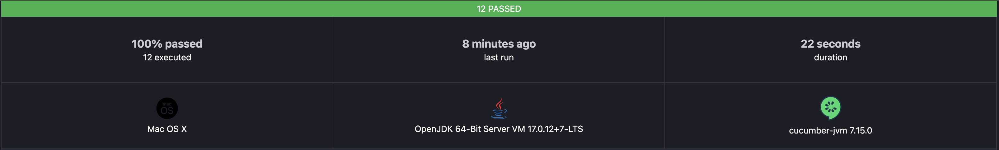
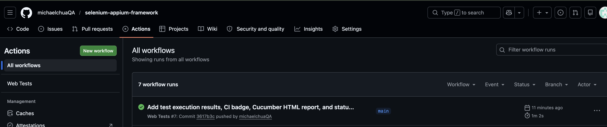

# Selenium + Appium Test Automation Framework


A comprehensive test automation framework for **web** and **mobile** testing using Selenium, Appium, TestNG, and **Cucumber BDD** with the Page Object Model design pattern.

## Tech Stack

| Component | Technology |
|-----------|------------|
| Language | Java 17 |
| Web Automation | Selenium 4 |
| Mobile Automation | Appium 9 (UiAutomator2 / XCUITest) |
| BDD Framework | Cucumber 7 (Gherkin) |
| Test Framework | TestNG |
| Build Tool | Maven |
| Reporting | Allure Reports + Cucumber HTML Reports |
| CI/CD | GitHub Actions |
| Driver Management | WebDriverManager |

## Project Structure

```
src/
├── main/java/com/qa/
│   ├── base/                 # BasePage with common actions
│   ├── config/               # Configuration reader
│   ├── driver/               # Web & Mobile driver factories
│   ├── pages/
│   │   ├── web/              # Web page objects (SauceDemo)
│   │   └── mobile/           # Mobile page objects
│   └── utils/                # Wait & screenshot utilities
└── test/
    ├── java/com/qa/tests/
    │   ├── base/             # Base test classes (TestNG)
    │   ├── hooks/            # Cucumber hooks (setup/teardown)
    │   ├── runners/          # Cucumber TestNG runners
    │   ├── steps/
    │   │   ├── web/          # Web step definitions
    │   │   └── mobile/       # Mobile step definitions
    │   ├── web/              # Web TestNG tests
    │   └── mobile/           # Mobile TestNG tests
    └── resources/
        ├── features/
        │   ├── web/          # Web .feature files
        │   └── mobile/       # Mobile .feature files
        ├── config.properties
        ├── testng-web.xml
        ├── testng-mobile.xml
        ├── testng-bdd-web.xml
        └── testng-bdd-mobile.xml
```

## Design Patterns

- **Behavior-Driven Development (BDD)** -- Gherkin feature files with Given/When/Then syntax
- **Page Object Model (POM)** -- each page/screen is a class with locators and actions
- **Factory Pattern** -- DriverFactory and MobileDriverFactory manage driver lifecycle
- **Thread-safe drivers** -- ThreadLocal ensures parallel test execution
- **Base Page abstraction** -- common interactions (click, type, wait) in one place

## Test Execution Results

### Cucumber HTML Report (12 Scenarios - 100% Passed)



A detailed Cucumber HTML report is generated after each test run with step-by-step results, timing, and screenshots on failure.

### CI/CD Pipeline



GitHub Actions runs tests automatically on every push and pull request.

### Sample Test Output

```
Scenario: Successful login with valid credentials
  Given I am on the SauceDemo login page                            ✓
  When I enter username "standard_user" and password "secret_sauce" ✓
  And I click the login button                                      ✓
  Then I should be redirected to the inventory page                 ✓
  And the page title should be "Products"                           ✓

Scenario: Login fails with locked out user
  Given I am on the SauceDemo login page                                               ✓
  When I enter username "locked_out_user" and password "secret_sauce"                  ✓
  And I click the login button                                                         ✓
  Then I should see an error message containing "Sorry, this user has been locked out" ✓

Scenario: Inventory page displays all products
  Given I am on the SauceDemo login page                            ✓
  When I enter username "standard_user" and password "secret_sauce" ✓
  And I click the login button                                      ✓
  Then I should see 6 products on the inventory page                ✓

Scenario: Add a single item to the cart
  Given I am on the SauceDemo login page                            ✓
  When I enter username "standard_user" and password "secret_sauce" ✓
  And I click the login button                                      ✓
  When I add the "Sauce Labs Backpack" to the cart                  ✓
  Then the cart badge should show "1"                               ✓

Tests run: 12, Failures: 0, Errors: 0, Skipped: 0
BUILD SUCCESS (25s)
```

## BDD Feature File Examples

### Web Login (`login.feature`)
```gherkin
Feature: Web Login Functionality
  As a user of SauceDemo
  I want to be able to login with my credentials
  So that I can access the inventory page

  Scenario: Successful login with valid credentials
    Given I am on the SauceDemo login page
    When I enter username "standard_user" and password "secret_sauce"
    And I click the login button
    Then I should be redirected to the inventory page
    And the page title should be "Products"

  Scenario: Login fails with locked out user
    Given I am on the SauceDemo login page
    When I enter username "locked_out_user" and password "secret_sauce"
    And I click the login button
    Then I should see an error message containing "Sorry, this user has been locked out"
```

### Mobile Login (`mobile_login.feature`)
```gherkin
Feature: Mobile Login Functionality
  As a mobile app user
  I want to be able to login with my credentials
  So that I can access the home screen

  Scenario: Successful mobile login with valid credentials
    Given the mobile app is launched
    When I enter mobile username "standard_user" and password "secret_sauce"
    And I tap the login button
    Then I should see the home screen with the cart button
```

## Prerequisites

### Web Testing
- Java 17+
- Maven 3.8+
- Chrome browser

### Mobile Testing
- Appium Server 2.x (`npm install -g appium`)
- Android SDK / Xcode
- Android Emulator or iOS Simulator
- Appium UiAutomator2 driver (`appium driver install uiautomator2`)

## Setup & Run

### Clone the repository
```bash
git clone https://github.com/michaelchuaQA/selenium-appium-framework.git
cd selenium-appium-framework
```

### Run BDD Web Tests (Cucumber)
```bash
mvn clean test -DsuiteXmlFile=src/test/resources/testng-bdd-web.xml
```

### Run BDD Mobile Tests (Cucumber)
Start Appium server first:
```bash
appium
```

Then run:
```bash
mvn clean test -DsuiteXmlFile=src/test/resources/testng-bdd-mobile.xml
```

### Run Standard Web Tests (TestNG)
```bash
mvn clean test -DsuiteXmlFile=src/test/resources/testng-web.xml
```

### Run Standard Mobile Tests (TestNG)
```bash
mvn clean test -DsuiteXmlFile=src/test/resources/testng-mobile.xml
```

### Run by Tag
```bash
mvn clean test -DsuiteXmlFile=src/test/resources/testng-bdd-web.xml -Dcucumber.filter.tags="@smoke"
```

### Generate Allure Report
```bash
mvn allure:serve
```

## Test Scenarios

### Web BDD Scenarios (SauceDemo)

| Feature | Scenario | Tags | Status |
|---------|----------|------|--------|
| Login | Successful login with valid credentials | @smoke @positive | Passing |
| Login | Login fails with locked out user | @negative | Passing |
| Login | Login fails with invalid credentials | @negative | Passing |
| Login | Login fails when username is empty | @negative | Passing |
| Login | Login fails when password is empty | @negative | Passing |
| Login | Login with multiple valid users (Scenario Outline x3) | @smoke @positive | Passing |
| Inventory | Inventory page displays all products | @smoke | Passing |
| Inventory | Add a single item to the cart | @cart | Passing |
| Inventory | Add multiple items to the cart | @cart | Passing |
| Inventory | Remove an item from the cart | @cart | Passing |

### Mobile BDD Scenarios (SauceLabs Sample App)

| Feature | Scenario | Tags |
|---------|----------|------|
| Mobile Login | Successful mobile login | @smoke @positive |
| Mobile Login | Login fails with invalid credentials | @negative |
| Mobile Login | User can logout | @positive |

## CI/CD


GitHub Actions runs web tests automatically on every push and pull request. See `.github/workflows/web-tests.yml`.

The pipeline:
1. Sets up JDK 17
2. Caches Maven dependencies
3. Installs Chrome
4. Runs BDD smoke tests + standard TestNG tests
5. Uploads test reports as downloadable artifacts

## Author

**Michael Chua** -- QA Automation Engineer | [GitHub](https://github.com/michaelchuaQA)
